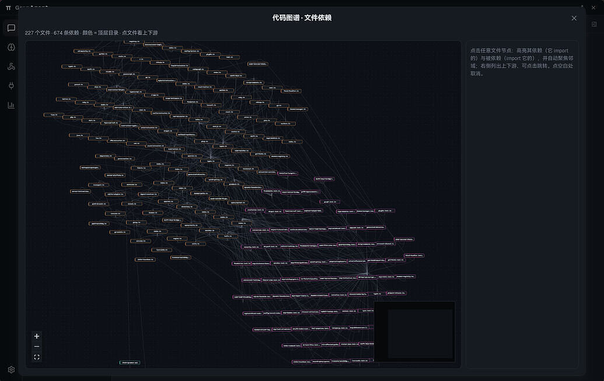
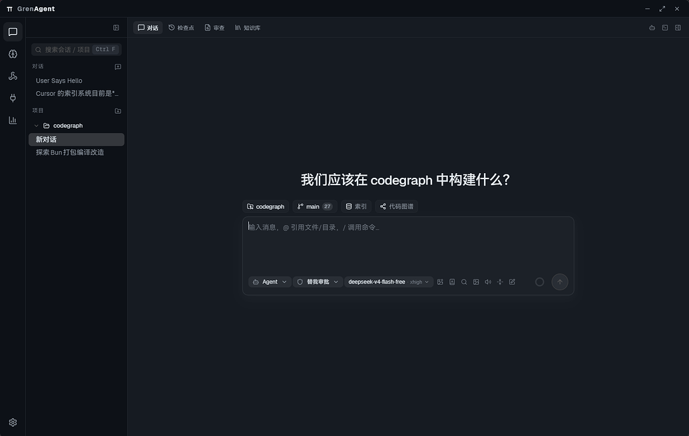
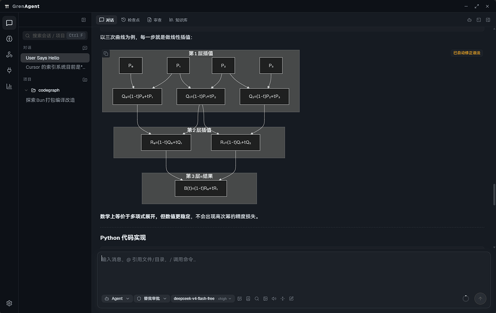
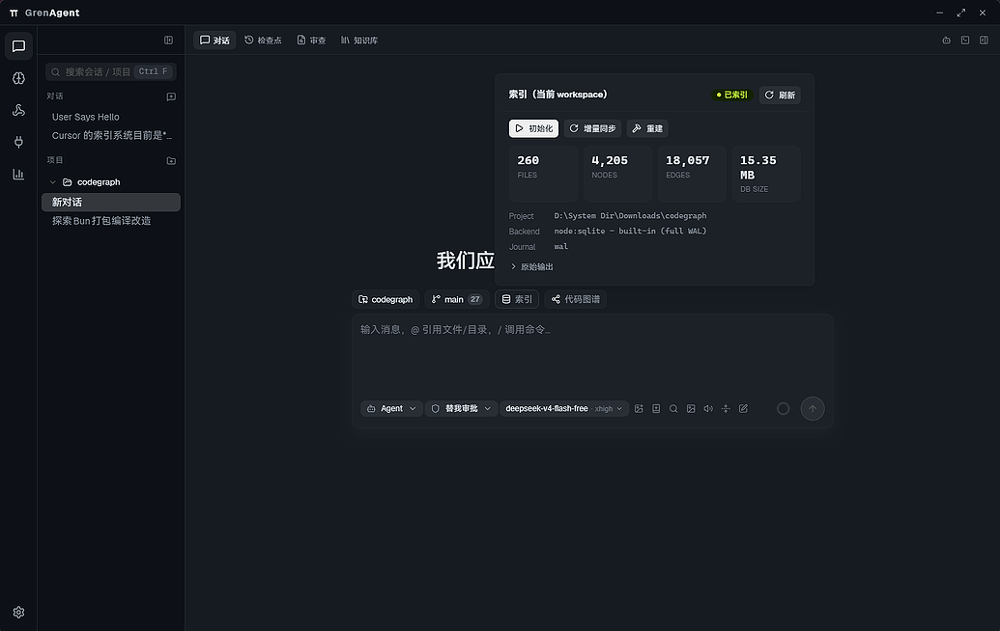
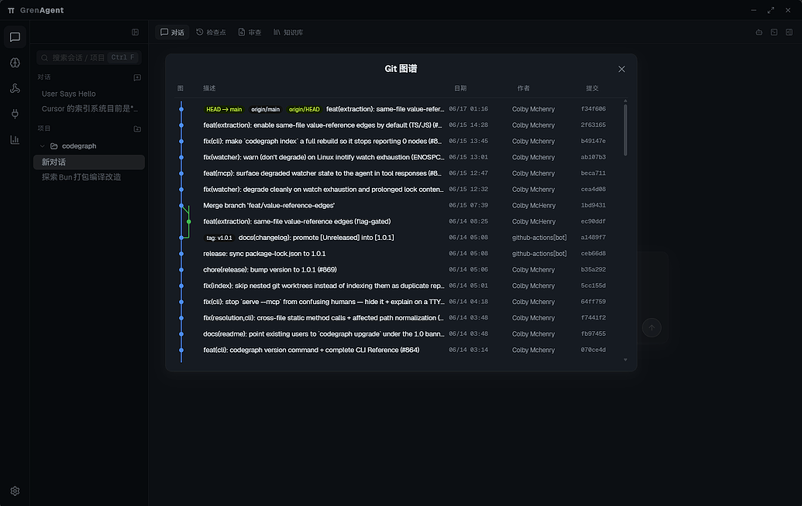
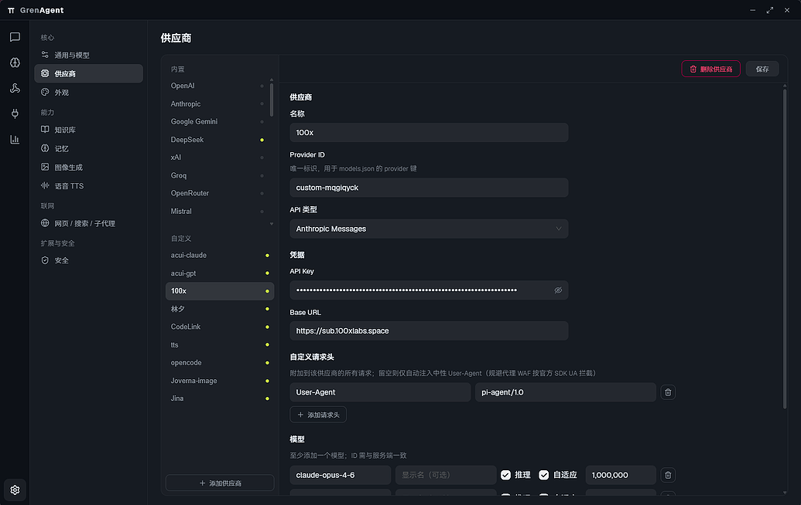
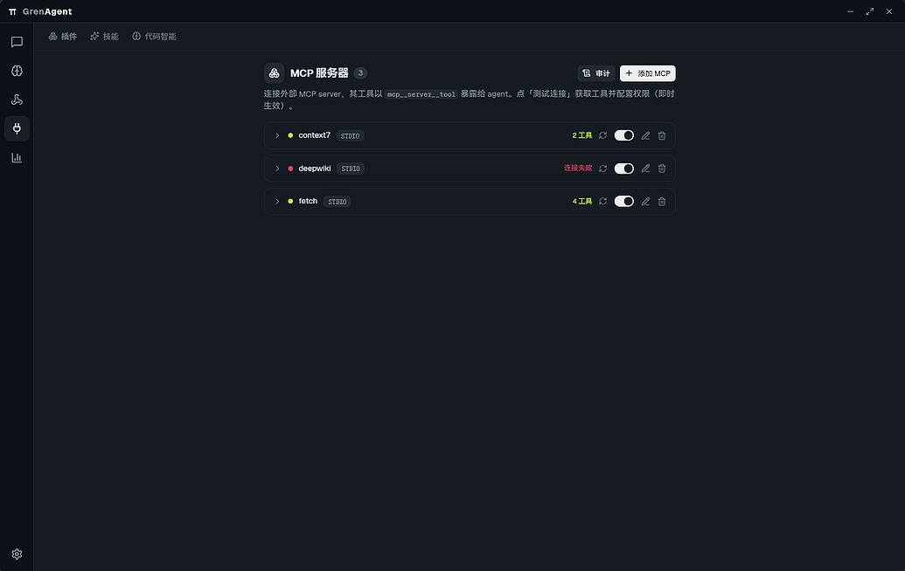
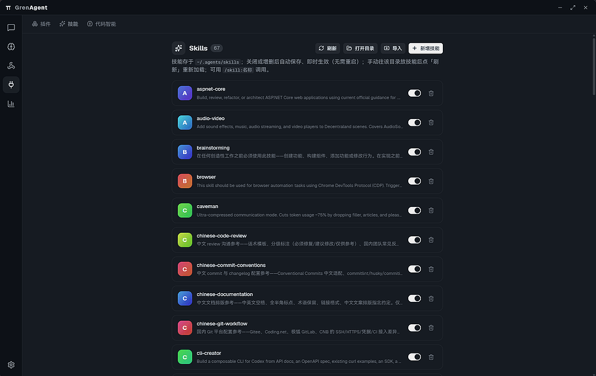

# GrenAgent

本地优先的桌面 AI 编码 Agent。基于 Pi 运行时（`@earendil-works/pi-coding-agent`），把对话、工具调用、代码智能、知识库与记忆整合进一个 Tauri 桌面应用，全程在本地运行。

<p align="center">
  
</p>

## 特性

<table>
  <tr>
    <td width="50%" valign="top">
      <br>
      <strong>多会话与项目管理</strong><br>
      按项目分组的侧栏，支持置顶、重命名、右键菜单、在资源管理器中打开。
    </td>
    <td width="50%" valign="top">
      <br>
      <strong>流式对话</strong><br>
      工具卡片、Mermaid 渲染、Plan / Questions / Answer 卡片、子代理（Sub-Agent）内联视图。
    </td>
  </tr>
  <tr>
    <td width="50%" valign="top">
      <br>
      <strong>代码智能</strong><br>
      内置 CodeGraph，离线、零配置，基于 tree-sitter 与 SQLite。
    </td>
    <td width="50%" valign="top">
      <br>
      <strong>Git 集成</strong><br>
      改动 diff、分支切换、提交图谱，与 workspace 上下文一体。
    </td>
  </tr>
  <tr>
    <td width="50%" valign="top">
      <br>
      <strong>多供应商</strong><br>
      多模型供应商配置与模型同步，生图、TTS、Embedding 等能力可分别选源。
    </td>
    <td width="50%" valign="top">
      <br>
      <strong>MCP 扩展</strong><br>
      连接外部 MCP server，工具以 <code>mcp__&lt;server&gt;__&lt;tool&gt;</code> 暴露给 Agent，面板内测试连接与权限配置。
    </td>
  </tr>
  <tr>
    <td width="50%" valign="top">
      <br>
      <strong>Skills 工作流</strong><br>
      从 <code>~/.agents/skills</code> 加载技能，<code>/skill:name</code> 调用，面板内启用/禁用。
    </td>
    <td width="50%" valign="top"></td>
  </tr>
</table>

此外还支持：

- **知识库 RAG** — 文件分块后做向量或关键词检索，面板内用原生文件选择器添加文档。
- **长期记忆** — 跨会话的记忆抽取与检索。
- **用量统计** — 按天、模型、项目聚合 Token 与费用。
- **终端 Dock** — 终端 tab 容器，子代理会话独立成 tab。
- **IM 接入** — 微信（ilink 官方 bot）扫码登录，手机遥控 Agent；「连接」面板展示登录状态与会话只读镜像。

## 架构

GrenAgent 由以下部分组成：

| 模块 | 包名 | 职责 |
| --- | --- | --- |
| `cli/` | `grenagent-agent-sidecar` | Agent sidecar。把 Pi 运行时与内置扩展编译成单个二进制（`binaries/pi`），由 Tauri 后端以 `--mode rpc` 拉起。 |
| `extensions/` | `pi-extensions-pack` | 内置扩展集合。由 `extensions/index.ts` 的 `allExtensions` 汇总（当前 36 个），随 sidecar 一并编译，无需全局安装。 |
| `tauri-agent/` | `grenagent-app` | 桌面应用。React 19 + TypeScript + Vite 前端，Tauri 2 / Rust 后端。 |
| `embedding/` | `embedding` | 独立本地向量服务（实验）。CPU 跑 `Xenova/all-MiniLM-L6-v2`，`POST /embed` 返回 384 维向量；尚未集成进主应用。 |

请求走 Tauri command（前端 `invoke` 调用 Rust 后端），后端以 RPC 管道驱动 sidecar；Agent 的流式输出通过 Tauri 事件回传前端。详见 [架构文档](./docs/architecture.md)。

## 快速开始

### 环境要求

- Node.js >= 22.5
- Rust 工具链（构建桌面端时需要，参见 Tauri 2 的环境要求）
- pnpm（Tauri 的 before-command 默认用 pnpm，详见 [开发指南](./docs/development.md)）

### 启动前端

```bash
cd tauri-agent
npm install
npm run dev
```

### 启动桌面端

```bash
cd tauri-agent
npm run tauri dev
```

## 内置扩展

Sidecar 通过 `extensions/index.ts` 的 `allExtensions` 编入 **36 个**内置扩展（`safety` 最先加载以尽早拦截）。扩展通过 `pi.registerTool()` 注册工具、`pi.registerCommand()` 注册斜杠命令；纯策略类扩展只挂 hook，无显式工具。

按职责大致分为：

| 类别 | 扩展 | 说明 |
| --- | --- | --- |
| 安全与策略 | `safety`、`approval`、`loop-guard`、`rulebook`、`mcp-policy` | 工具拦截、审批策略、死循环检测、声明式规则、MCP 工具权限 |
| 会话管理 | `auto-title`、`checkpoint`、`compaction-policy`、`session-memory`、`session-search`、`goal`、`todo` | 自动标题、工作区快照、上下文压缩、会话状态、历史搜索、目标驱动、待办 |
| 模式与交互 | `agent-mode`、`diagram-hint` | Agent / Ask / Debug / Plan 模式；Mermaid / KaTeX 渲染提示 |
| 知识与记忆 | `knowledge-rag`、`long-term-memory` | 知识库 RAG（`kb_search` / `kb_add`）；跨会话记忆（`memory_*`） |
| 联网与信息 | `web-fetch`、`web-search` | 单页抓取（`fetch_url`）；多引擎搜索与站点抓取（`web_search` 等） |
| MCP | `mcp` | 连接外部 MCP server，工具名 `mcp__<server>__<tool>` |
| 媒体生成 | `image-gen`、`tts` | 文生图（`generate_image`）；语音合成（`speak`） |
| 代码智能 | `code-intel`、`code-search`、`ast-tools`、`lsp`、`hashline`、`batch-tools`、`code-exec`、`debug-tools`、`dap`、`code-review`、`diagnostics` | CodeGraph 探索、代码搜索、AST 编辑、LSP、行号编辑、批量读写、Python/JS 执行、调试日志、DAP、审查、诊断 |
| 多代理 | `multi-agent` | 子代理委派（`spawn_agent`） |
| 外部集成 | `github` | GitHub CLI 封装（`github`） |
| IM 接入 | `im-gateway`、`im-platforms` | HTTP webhook 网关；微信 ilink bot（`/im`） |

完整清单与工具名见 [架构文档 — 内置扩展](./docs/architecture.md#内置扩展)。

## 文档

- [架构文档](./docs/architecture.md)
- [开发指南](./docs/development.md)

## 目录结构

```
.
├── cli/            # Agent sidecar（grenagent-agent-sidecar），汇总扩展编译为 binaries/pi
├── extensions/     # 内置扩展集合，由 extensions/index.ts 的 allExtensions 编入 sidecar
├── embedding/      # 独立本地向量服务（实验，未集成进主应用）
├── tauri-agent/    # 桌面应用（grenagent-app）
│   ├── src/        # React 前端：features / stores / lib / components / theme
│   └── src-tauri/  # Tauri / Rust 后端：commands / state
└── docs/           # 架构与开发文档，及 superpowers/ 下的设计规格与实现计划
```

## 许可证

本项目采用 MIT 协议。

## 友情链接

- [LINUX DO](https://linux.do/) — 新的理想型社区

## 命名说明

产品名为 GrenAgent。底层 Agent 运行时为 Pi（`pi-coding-agent`），sidecar 二进制名为 `pi`。内部 CSS 设计变量 `--gren-*` 与若干 localStorage 持久化键属于实现细节，不对外作为品牌。
